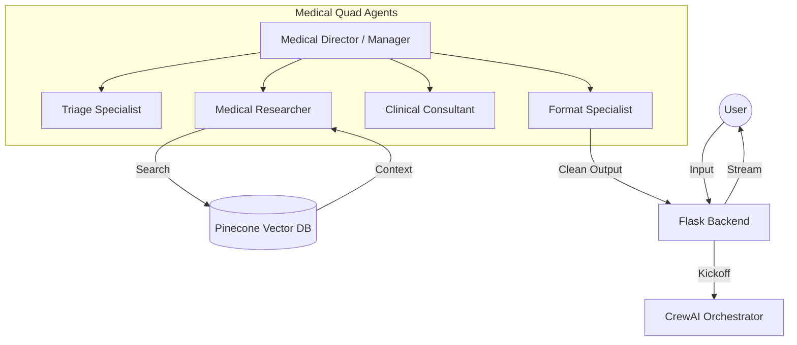

# Clinical Multi-Agent RAG System 🩺🤖

A professional-grade medical consultation system built with **CrewAI**, **Google Gemini 2.0 Flash**, and **Pinecone**. This project demonstrates a hierarchical multi-agent orchestration for clinical triage, medical research, and patient consultation.


## 🌟 Key Features

- **Hierarchical Multi-Agent Architecture**: Uses a "Manager-Worker" pattern to ensure high-quality clinical outputs and supervised execution.
- **Fact-Based RAG Pipeline**: Integrates with a Vector Database (Pinecone) to retrieve verified medical data from clinical PDFs, reducing hallucination.
- **Specialized Agent Roles**: Four distinct agents (Triage, Researcher, Consultant, Formatter) with unique personas and goals.
- **Real-Time Streaming Interface**: Custom Server-Sent Events (SSE) implementation with advanced buffering for seamless Thai language display.
- **Clinical Safety Guards**: Built-in emergency detection and strict formatting rules to prevent "AI meta-talk".

## 🏗️ System Architecture



## 👥 Meet the Clinical Quad

| Agent                   | Role                  | Responsibility                                                               |
| :---------------------- | :-------------------- | :--------------------------------------------------------------------------- |
| **Triage Specialist**   | Intent Classification | Identifies if the case is a greeting, a symptom, or a medical emergency.     |
| **Medical Researcher**  | Knowledge Retrieval   | Searches internal clinical databases for facts, medications, and guidelines. |
| **Clinical Consultant** | Patient Interaction   | Conducts empathetic interviews, asks follow-up questions, and gives advice.  |
| **Format Specialist**   | Quality Control       | Enforces strict Thai language rules, bullet points, and clinical tone.       |

## 🛠️ Tech Stack

- **Backend**: Python, Flask, CrewAI
- **LLMs**: Google Gemini 2.0 Flash (Manager & Workers)
- **Embeddings**: Google Generative AI (`models/gemini-embedding-001`)
- **Database**: Pinecone (Vector Search)
- **Frontend**: React, Next.js, Tailwind CSS, Lucide Icons

## 🚀 Getting Started

### Prerequisites

- Python 3.10+
- Node.js 18+
- Google API Key (for Gemini)
- Pinecone API Key

### Installation

1. **Clone the repository**

   ```bash
   git clone https://github.com/your-username/Medical-Chatbot.git
   cd Medical-Chatbot
   ```

2. **Backend Setup**

   ```bash
   python -m venv .venv
   source .venv/bin/activate  # Windows: .venv\Scripts\activate
   pip install -r requirements.txt
   ```

3. **Frontend Setup**

   ```bash
   cd frontend
   npm install
   ```

4. **Environment Variables**
   Create a `.env` file in the root:
   ```env
   GOOGLE_API_KEY=your_key
   PINECONE_API_KEY=your_key
   PINECONE_INDEX_NAME=medical-index
   ```

## 🧠 Technical Challenges & Solutions

### 1. Thai Language Streaming Data Loss

**Problem**: Standard SSE chunks often cut Thai characters (multi-byte) in half, causing "corrupted" display.
**Solution**: Implemented a custom buffering logic in the React frontend that accumulates chunks and validates character completion before rendering. (See `src/utils/chatUtils.ts`)

### 2. Multi-Agent Hallucination Control

**Problem**: High-level agents sometimes ignore research results in favor of pre-trained knowledge.
**Solution**: Used `Process.hierarchical` in CrewAI to allow a Manager LLM to validate the Consultant's draft against the Researcher's findings before final delivery.

---

_Created with ❤️ for the medical community._
